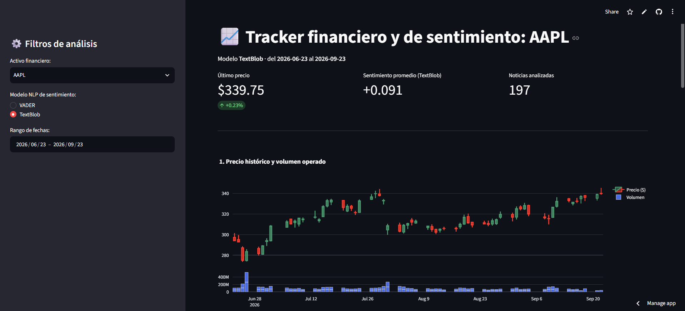
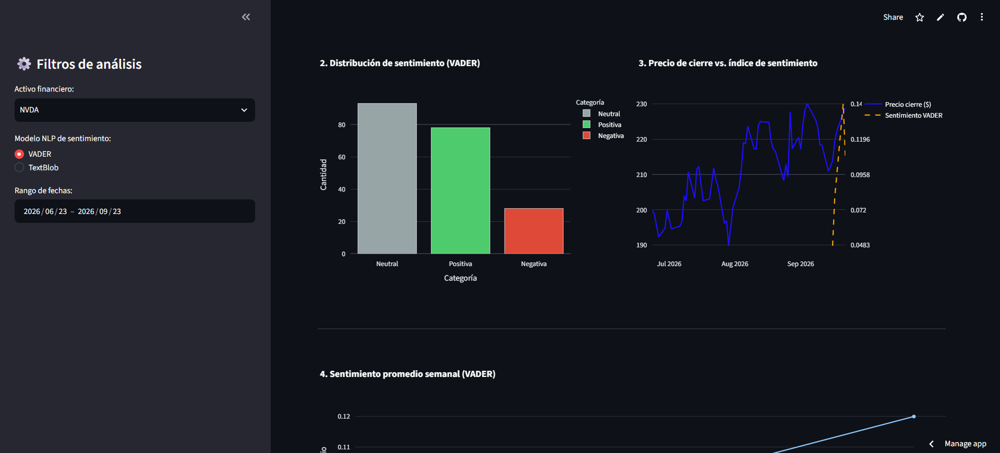
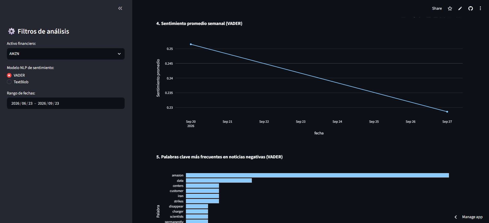

# Proyecto 4: Pipeline de Datos en Vivo, NLP y Dashboard Interactivo

Este proyecto es un pipeline de datos que extrae información de noticias recientes y precios de acciones para 5 empresas (AAPL, TSLA, NVDA, AMZN, MSFT). El objetivo es cruzar la información y lograr detectar una correlación entre sentimiento y volatilidad.

## App en vivo
La aplicación interactiva se realizó en Python 3.x utilizando **Streamlit Community Cloud** para el despliegue en vivo. 
https://pochoavproyecto4pipeline.streamlit.app/

## Dashboard en uso
Dentro de la aplicación en Streamlit Community Cloud se puede cambiar el *ticker* entre las distintas empresas, el rango de fechas y el modelo de NLP (VADER o TextBlob)





## Arquitectura de análisis
```
yfinance ──┐
           ├─→ fetch_data.py ─→ market_data.db (SQLite)
NewsAPI ───┘                          │
                                       ▼
                              nlp_analysis.py
                        (VADER + TextBlob + NLTK)
                                       │
                                       ▼
                              market_data.db (actualizada)
                                       │
                                       ▼
                                   app.py
                          (Streamlit + Plotly, en la nube)
```

El texto crudo de cada titular se analiza con **VADER** y **TextBlob** en paralelo (sin limpiar, para no perder señales como mayúsculas o signos de exclamación). Por separado, **NLTK** tokeniza y limpia el mismo texto exclusivamente para el análisis de palabras clave frecuentes en noticias negativas.

## Estructura de repositorio
```
proyecto_4_pipeline_entrega/
├── data/
│   └── market_data.db
├── src/
│   ├── fetch_data.py
│   └── nlp_analysis.py
├── app.py
├── requirements.txt
├── .gitignore
├── reporte_tecnico.pdf
└── README.md
```
## Instalación local
```bash
git clone https://github.com/pochoav/proyectos_analisis_de_datos.git
cd proyecto_4_pipeline_entrega
pip install -r requirements.txt
```
Se debe crear un archivo '.env' en la raiz del proyecto con la API Key de [NewsAPI](https://newsapi.org)

```
NEWS_API_KEY=tu_api_key_aqui
```

## Ejecución 
```bash
python src/fetch_data.py      # descarga precios y noticias
python src/nlp_analysis.py    # calcula sentimiento (VADER + TextBlob)
streamlit run app.py          # levanta el dashboard
```

